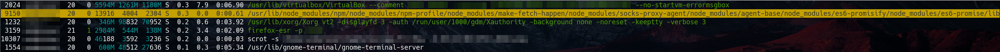

# nester
Simple script that suggest the most nested path to call any script.   

ps, top, and htop outputs truncate the path of the processes that are launched.   
As a result, you can hide your script's path if the path you are calling it from is long enough.   
Using dotdots, you can call your script from any path.  

This is useful when you do not have root privileges, and are only able to drop a script inside an obvious folder (/home/$USER, /tmp/, /var/tmp/...)

#### Usage
`nester <root path> <path of your script>`

#### Example :
`$ ./nester /usr/lib/ /tmp/nasty.sh`   

**output :**
`/usr/lib/node_modules/npm/node_modules/npm-profile/node_modules/make-fetch-happen/node_modules/socks-proxy-agent/node_modules/agent-base/node_modules/es6-promisify/node_modules/es6-promise/lib/es6-promise/promise/../../../../../../../../../../../../../../../../../../../tmp/nasty.sh`

**htop output**

probz to Yassine S.
